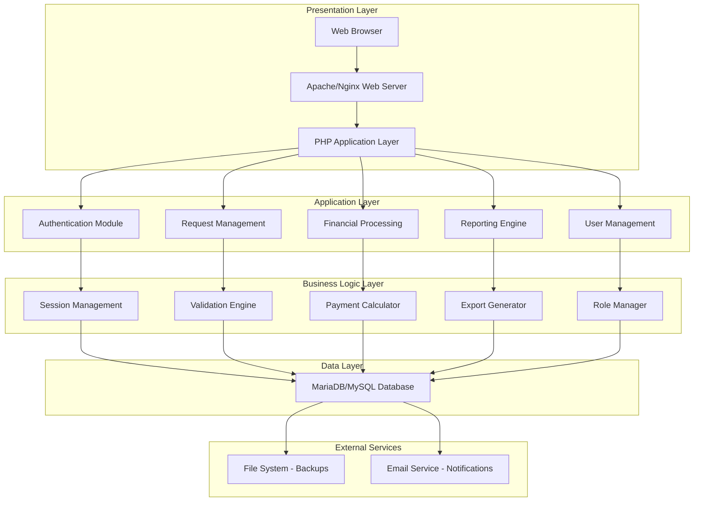
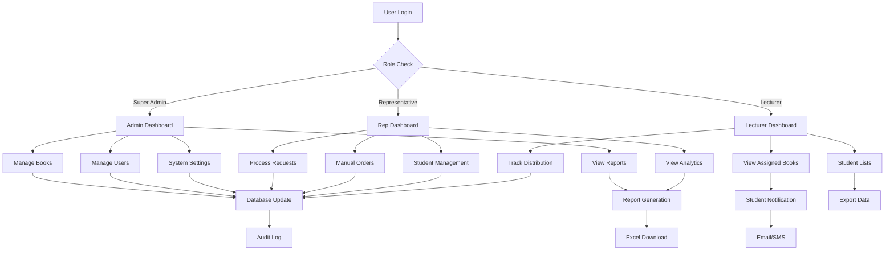
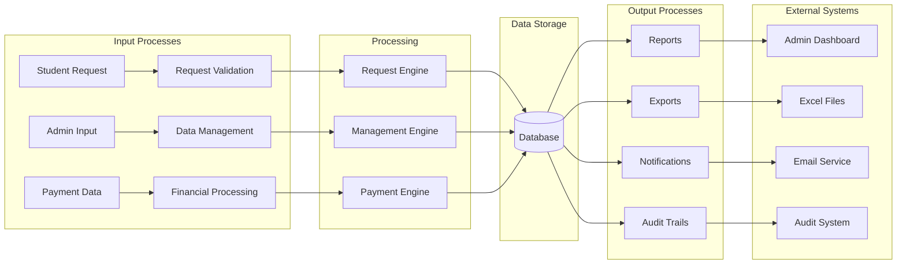
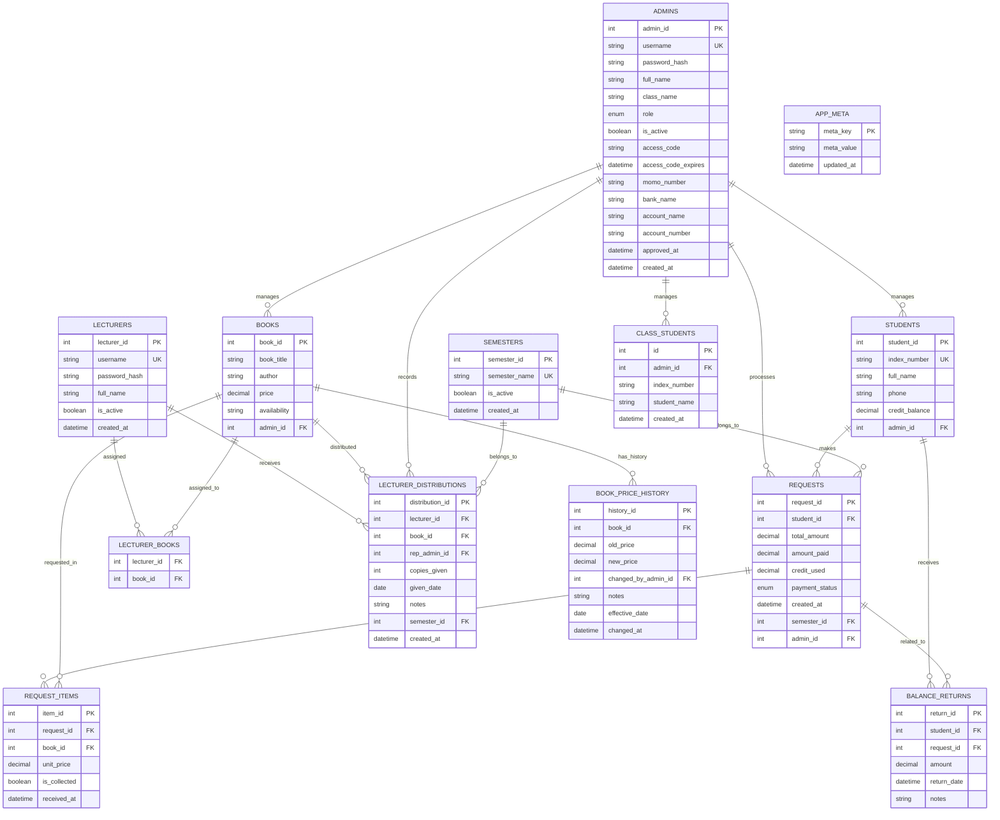
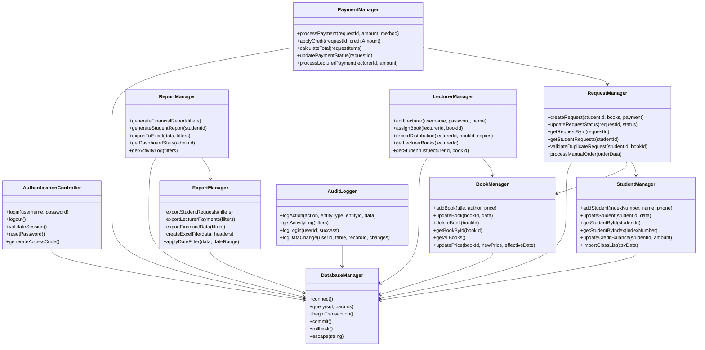
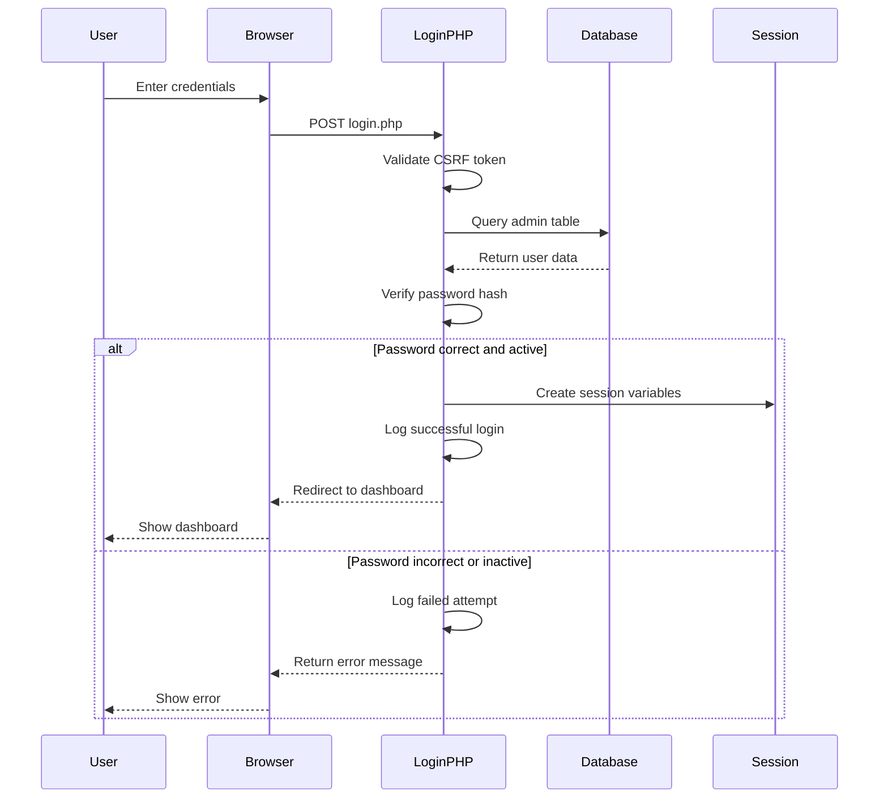
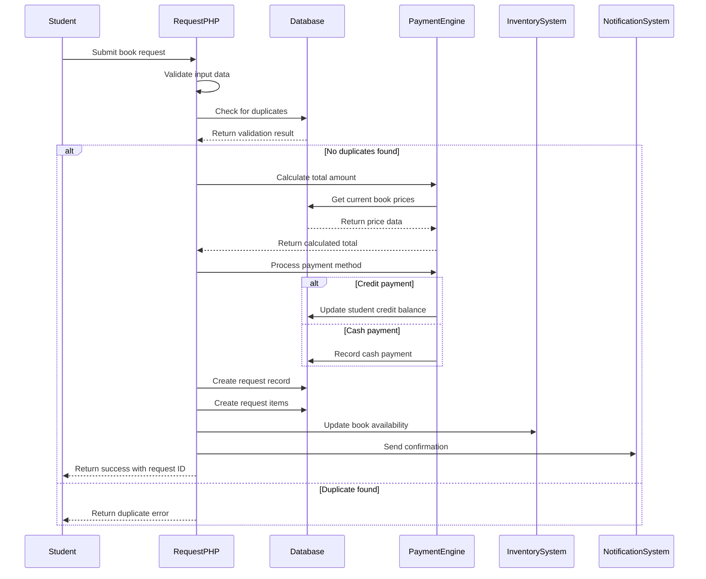
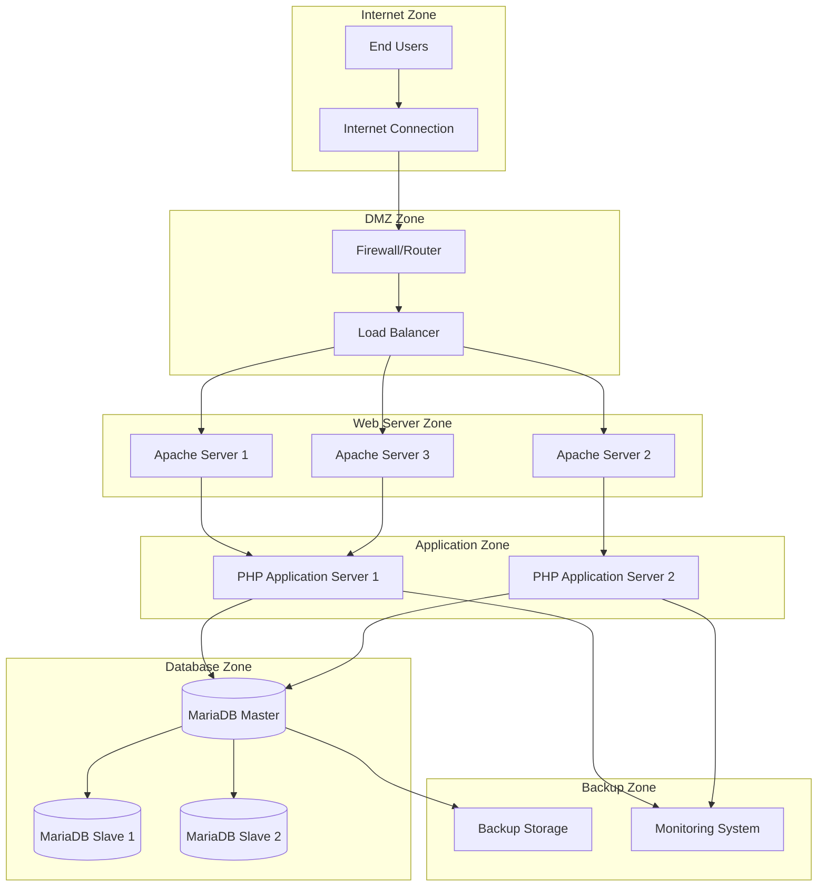

# Book Distribution System - Project Documentation

## Executive Summary

The Book Distribution System is a comprehensive web-based platform designed to streamline the management, distribution, and tracking of educational books within academic institutions. The system addresses critical challenges in manual book distribution processes by providing centralized control, automated workflows, and real-time tracking capabilities.

## Problem Statement & Solution

### Core Problems Solved

1. **Manual Book Distribution Chaos**
   - **Problem**: Paper-based book requests lead to lost orders, duplicate entries, and tracking nightmares
   - **Solution**: Digital request system with automated tracking and validation

2. **Financial Management Complexity**
   - **Problem**: Manual payment tracking, credit management, and lecturer payments create accounting errors
   - **Solution**: Integrated financial system with automated calculations, credit tracking, and payment reconciliation

3. **Multi-Role Coordination Issues**
   - **Problem**: Poor communication between administrators, representatives, lecturers, and students
   - **Solution**: Role-based access control with tailored dashboards and workflows

4. **Data Silos and Reporting Gaps**
   - **Problem**: No centralized data for analytics, reporting, or audit trails
   - **Solution**: Unified database with comprehensive reporting and export capabilities

5. **Scalability Constraints**
   - **Problem**: Manual processes cannot handle growing student populations and book catalogs
   - **Solution**: Scalable web architecture supporting unlimited users and transactions

## System Features

### Core Functionality

#### 1. User Management & Authentication
- **Multi-Role System**: Super Admin, Representatives, Lecturers
- **Secure Authentication**: Password hashing, session management, CSRF protection
- **Access Control**: Role-based permissions and data filtering
- **Profile Management**: User settings and password reset workflows

#### 2. Book Management
- **Catalog Management**: Add, edit, and deactivate books
- **Price Management**: Historical pricing with effective dates
- **Inventory Tracking**: Stock levels and availability status
- **Semester-based Organization**: Academic period management

#### 3. Student Management
- **Student Records**: Index numbers, contact information, credit balances
- **Bulk Import**: CSV-based class list uploads
- **Credit System**: Pre-paid credits and balance management
- **Request History**: Complete transaction records

#### 4. Request Processing
- **Digital Requests**: Online book ordering with validation
- **Manual Orders**: Admin-driven order creation
- **Duplicate Prevention**: Automatic detection of duplicate requests
- **Status Tracking**: Real-time request status updates

#### 5. Financial Management
- **Payment Processing**: Cash, credit, and combined payments
- **Credit Reconciliation**: Automated credit application and balance updates
- **Lecturer Payments**: Commission tracking and payment processing
- **Financial Reporting**: Revenue, balance, and transaction reports

#### 6. Distribution Management
- **Collection Tracking**: Book pickup/delivery status
- **Date-based Filtering**: Request vs. received date tracking
- **Export Functionality**: Excel exports with date range filtering
- **Audit Trails**: Complete transaction history

#### 7. Reporting & Analytics
- **Dashboard Analytics**: Real-time statistics and KPIs
- **Excel Exports**: Customizable data exports
- **Activity Logging**: Comprehensive audit trails
- **Financial Reports**: Revenue, balance, and payment summaries

## Technical Architecture

### High-Level System Architecture (HLSA)



### System Flowchart



### Data Flow Diagram



### Use Case Diagram

```mermaid
graph TD
    subgraph "Actors"
        SA[Super Admin]
        REP[Representative]
        LEC[Lecturer]
        SYS[System]
    end
    
    subgraph "Authentication Use Cases"
        UC1[Login]
        UC2[Logout]
        UC3[Reset Password]
    end
    
    subgraph "Admin Use Cases"
        UC4[Manage Books]
        UC5[Manage Users]
        UC6[View Reports]
        UC7[System Settings]
        UC8[Manual Orders]
    end
    
    subgraph "Representative Use Cases"
        UC9[Process Requests]
        UC10[Student Management]
        UC11[Payment Processing]
        UC12[View Analytics]
        UC13[Bulk Import]
    end
    
    subgraph "Lecturer Use Cases"
        UC14[View Books]
        UC15[Track Distribution]
        UC16[Student Lists]
        UC17[Export Data]
    end
    
    SA --> UC1
    SA --> UC2
    SA --> UC3
    SA --> UC4
    SA --> UC5
    SA --> UC6
    SA --> UC7
    SA --> UC8
    
    REP --> UC1
    REP --> UC2
    REP --> UC3
    REP --> UC9
    REP --> UC10
    REP --> UC11
    REP --> UC12
    REP --> UC13
    
    LEC --> UC1
    LEC --> UC2
    LEC --> UC14
    LEC --> UC15
    LEC --> UC16
    LEC --> UC17
    
    SYS --> UC1
    SYS --> UC2
```



### E-R Diagram and Database Schema



### Class Diagram



### Site Map and Wireframe

#### Site Map Structure
```
book_distribution_system/
├── login.php                  # Authentication entry point
├── logout.php                 # Session termination
├── admin.php                  # Super Admin dashboard
├── rep_dashboard.php          # Representative dashboard
├── lecturer_dashboard.php     # Lecturer portal
├── lecturer_login.php         # Lecturer authentication
├── 
├── admin_management/
│   ├── manage_books.php       # Book catalog management
│   ├── manage_reps.php        # Representative management
│   ├── manage_lecturers.php   # Lecturer management
│   ├── admin_manual_order.php # Manual order creation
│   └── admin_setup.php        # System configuration
├── 
├── request_management/
│   ├── submit_request.php     # Student request submission
│   ├── view_request.php       # Request details view
│   ├── edit_request.php       # Request modification
│   ├── delete_request.php     # Request deletion
│   └── toggle_book_collection.php # Collection status toggle
├── 
├── financial_management/
│   ├── lecturer_payments.php   # Lecturer payment processing
│   ├── toggle_payment.php      # Payment status toggle
│   ├── get_student_credit.php  # Credit balance lookup
│   └── payment_instructions.php # Payment guidelines
├── 
├── student_management/
│   ├── student_history.php    # Student request history
│   ├── upload_class.php        # Bulk student import
│   ├── get_student_details.php # Student information API
│   ├── get_student_name.php    # Name lookup API
│   └── check_student_books.php # Book validation API
├── 
├── reporting/
│   ├── export_excel.php       # Excel export engine
│   ├── view_rep_data.php       # Representative analytics
│   ├── lecturer_rep_view.php  # Lecturer-representative view
│   └── activity_log.php        # System activity log
├── 
├── user_management/
│   ├── my_profile.php          # User profile management
│   ├── rep_signup.php          # Representative registration
│   ├── lecturer_signup.php    # Lecturer registration
│   └── generate_access_code.php # Access code generation
└── 
└── system/
    ├── maintenance.php         # System maintenance mode
    ├── setup_tasks.php         # Background task setup
    ├── backup_worker.php       # Automated backup engine
    └── ajax_student_lookup.php # AJAX student search
```

#### Wireframe Layouts

```mermaid
graph TB
    subgraph "Header Navigation"
        A[Logo] --> B[Navigation Menu]
        B --> C[User Profile]
        C --> D[Logout Button]
    end
    
    subgraph "Dashboard Layout"
        E[Welcome Section] --> F[Quick Stats Cards]
        F --> G[Recent Activity]
        G --> H[Quick Actions]
        H --> I[Charts/Graphs]
    end
    
    subgraph "Form Layouts"
        J[Form Header] --> K[Input Fields]
        K --> L[Validation Messages]
        L --> M[Action Buttons]
        M --> N[CSRF Token]
    end
    
    subgraph "Table Layouts"
        O[Search/Filter Bar] --> P[Data Table]
        P --> Q[Pagination]
        Q --> R[Export Options]
    end
    
    subgraph "Modal Layouts"
        S[Modal Header] --> T[Modal Body]
        T --> U[Modal Footer]
        U --> V[Close/Cancel Buttons]
    end
```



### Activity Diagram and Sequence Diagram

#### Request Processing Activity Diagram

```mermaid
activityDiagram
    start
    :Student Access System;
    :Login Authentication;
    if (Authentication Success?) then (yes)
        :Select Books;
        :Enter Student Information;
        :Choose Payment Method;
        if (Credit Available?) then (yes)
            :Apply Credit Balance;
            :Calculate Remaining Amount;
        else (no)
            :Full Cash Payment;
        endif
        :Submit Request;
        :Generate Request ID;
        :Send Confirmation;
        :Update Inventory;
        :Log Transaction;
        stop
    else (no)
        :Show Error Message;
        :Redirect to Login;
        stop
    endif
```

#### Login Authentication Sequence Diagram



#### Book Request Processing Sequence Diagram



### Network Diagram



## Technical Implementation Details

### Technology Stack

#### Frontend
- **HTML5/CSS3**: Semantic markup and responsive design
- **JavaScript**: Client-side validation and AJAX interactions
- **Bootstrap**: UI framework for responsive components
- **Chart.js**: Data visualization for dashboards

#### Backend
- **PHP 8.x**: Server-side application logic
- **MariaDB/MySQL**: Relational database management
- **Apache/Nginx**: Web server configuration
- **XAMPP**: Development environment stack

#### Security
- **Password Hashing**: bcrypt for secure password storage
- **CSRF Protection**: Token-based request validation
- **Session Management**: Secure session handling
- **SQL Injection Prevention**: Prepared statements
- **Input Validation**: Server-side data sanitization

#### Performance
- **Database Indexing**: Optimized query performance
- **Caching**: Session and result caching
- **Connection Pooling**: Database connection management
- **Async Processing**: Background task execution

### Database Design Patterns

#### Normalization
- **Third Normal Form (3NF)**: Eliminates data redundancy
- **Foreign Key Constraints**: Referential integrity
- **Index Optimization**: Query performance enhancement

#### Migration Strategy
- **Version Control**: Database schema migrations
- **Backward Compatibility**: Smooth upgrade paths
- **Data Integrity**: Consistent data transformation

### Security Architecture

#### Authentication Flow
1. **Login Request**: Username/password submission
2. **Credential Verification**: Database authentication
3. **Session Creation**: Secure session establishment
4. **Authorization Check**: Role-based access validation
5. **Activity Logging**: Security event tracking

#### Data Protection
- **Encryption**: Sensitive data protection
- **Access Control**: Role-based permissions
- **Audit Trail**: Complete activity logging
- **Backup Security**: Encrypted backup storage

## Deployment Architecture

### Production Environment

#### Server Configuration
- **Web Server**: Apache with mod_rewrite
- **PHP Version**: 8.0+ with required extensions
- **Database**: MariaDB 10.6+ or MySQL 8.0+
- **SSL Certificate**: HTTPS encryption

#### High Availability
- **Load Balancing**: Multiple web servers
- **Database Replication**: Master-slave configuration
- **Backup Strategy**: Automated daily backups
- **Monitoring**: Real-time system health checks

### Development Environment

#### Local Setup
- **XAMPP**: Complete development stack
- **Version Control**: Git repository management
- **Debug Tools**: XDebug for PHP debugging
- **Testing Framework**: PHPUnit for unit testing

## Maintenance and Support

### System Monitoring
- **Performance Metrics**: Response time tracking
- **Error Logging**: Comprehensive error tracking
- **Resource Monitoring**: CPU, memory, disk usage
- **User Analytics**: System usage statistics

### Backup Strategy
- **Automated Backups**: Daily database dumps
- **Incremental Backups**: Regular file system backups
- **Off-site Storage**: Cloud backup replication
- **Recovery Testing**: Regular restore validation

## Future Enhancements

### Scalability Improvements
- **Microservices Architecture**: Service decomposition
- **API Development**: RESTful API endpoints
- **Mobile Application**: Native mobile apps
- **Cloud Migration**: Cloud hosting deployment

### Feature Enhancements
- **Advanced Analytics**: Business intelligence tools
- **Integration APIs**: Third-party system integration
- **Automation**: Workflow automation
- **AI Features**: Predictive analytics and recommendations

## Conclusion

The Book Distribution System represents a comprehensive solution to the complex challenges of educational book management. Through careful architectural design, robust security implementation, and scalable technology choices, the system provides a solid foundation for efficient book distribution processes.

The modular design ensures maintainability and extensibility, while the comprehensive security measures protect sensitive data and maintain system integrity. The role-based access control and detailed audit trails provide the transparency and accountability required in educational environments.

This system successfully transforms manual, error-prone processes into an efficient, automated, and scalable solution that can grow with the institution's needs while maintaining data integrity and user satisfaction.
